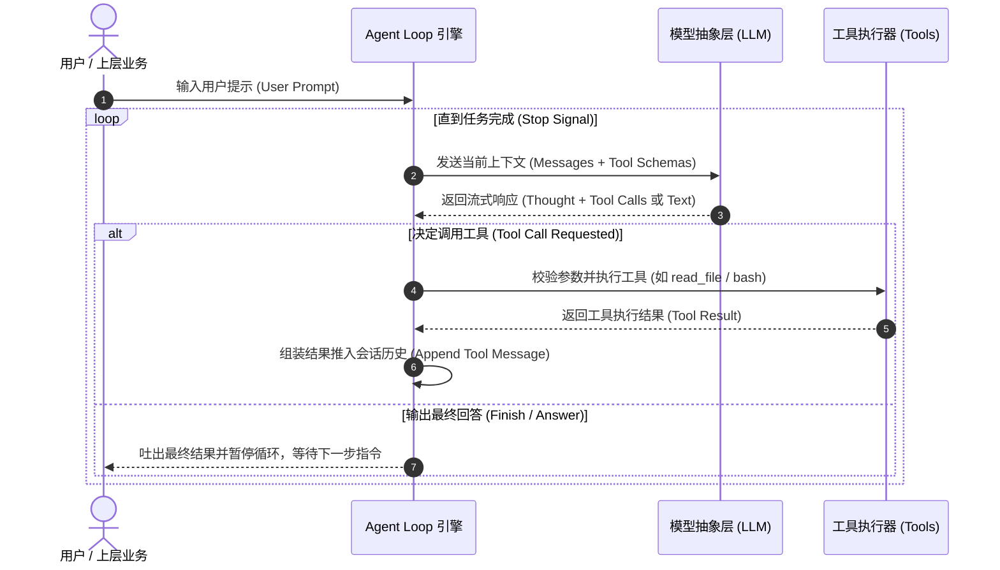

# Pi-Agent 底层原理与二次开发实践知识文档

> **参考来源**：Bilibili 视频《【完整版】一口气学会pi-agent的底层原理和二开实践》（UP主：费曼学徒冬瓜）  
> **文档定位**：本地 AI Agent（智能体）底层架构解析、核心机制剖析与二次开发落地工程指南

---

## 1. 架构总览与核心设计哲学

### 1.1 什么是 Pi-Agent？
**Pi-Agent** 并非一个黑盒一体化的终端产品，而是一个**轻量级、高度模块化的 Agent 运行时底座（Agent Harness / Runtime）**。许多业界前沿的开源智能体及 AI Coding 产品（如 OpenClaw 等）均采用 Pi 的架构思想或以其为核心引擎。

### 1.2 核心设计哲学：“极简、无魔术、完全控制”
相比于 LangChain、AutoGen 等早期框架往往采用复杂的预设抽象（重型链式封装、深层继承、黑盒调用），Pi-Agent 践行**极简主义（Minimalism）**：
* **No Magic（拒绝黑盒魔法）**：所有状态流转、LLM 交互、工具执行过程均完全透明、可观测、可中断。
* **Harness 理念（底盘思维）**：只做好 Agent 的“底盘”（生命周期循环、模型抽象、事件流、上下文压缩），把业务工具、提示词系统、人机协同逻辑的完全控制权交还给二次开发者。
* **分层解耦**：模型适配、循环引擎、垂直应用严格分层，避免强耦合。

```
+-------------------------------------------------------------+
|                      应用层 (Application)                   |
|       CLI / REPL / Web UI / VS Code Extension / RPC Service  |
+-------------------------------------------------------------+
                              |
+-------------------------------------------------------------+
|               产品能力层 (pi-coding-agent)                  |
|    - 编程工具集: read_file, edit_file, bash, grep, find...   |
|    - 会话交互控制器、默认提示词 (SYSTEM.md)                 |
+-------------------------------------------------------------+
                              |
+-------------------------------------------------------------+
|                核心引擎层 (pi-agent-core)                   |
|    - Agent Loop (调度循环)    - Session Tree (会话分支树)    |
|    - Tool Execution & 拦截   - Context Compaction (上下文压缩) |
|    - Event System (全链路事件订阅)                          |
+-------------------------------------------------------------+
                              |
+-------------------------------------------------------------+
|                 模型抽象层 (pi-ai)                           |
|    - 统一多供应商 API (OpenAI, Claude, Gemini, DeepSeek, 本地模型) |
|    - 统一流式输出 (Streaming) 与 Tool Call 协议              |
+-------------------------------------------------------------+
```

---

## 2. 核心底层原理深度拆解

### 2.1 Agent Loop（智能体驱动大循环）
现代 Agent 的本质是一个由 LLM 控制的**有限状态机闭环**：



* **无限循环与自愈机制**：如果工具执行报错（例如语法错误、文件不存在、命令超时），错误信息会以 `Tool Result` 的形式直接喂回给 LLM，大模型根据报错日志自我调整并再次尝试调用修复，形成闭环自愈。
* **单步可控**：引擎支持在循环间隙进行拦截（如用户确认危险操作、注入中间指导等）。

---

### 2.2 上下文工程与自动压缩（Context Compaction）
在长任务（如重构一个项目、连续排查 bug）中，上下文窗口会随着工具调用的输出（如几千行代码、庞大的日志）迅速膨胀，面临 **Token 耗尽、显存爆炸、模型注意力发散（Lost in the Middle）** 的问题。

Pi-Agent 的解决机制：
1. **滑动窗口与渐进式压缩**：
   * 当会话 Token 达到预设阈值时触发 `Compaction`。
   * 系统将早期对话和冗长且已无时效性的工具输出（如旧的 grep 搜索结果）替换为模型生成的精简结构化摘要（Summary）。
2. **保留关键状态**：
   * 必须严格保留：**System Prompt**、**当前任务目标**、**已修改文件列表/环境现状**、**最近 N 轮对话及当前待办**。
   * 丢弃/折叠：历史中间尝试的详细排错输出。

---

### 2.3 会话树与分支机制（Session Tree & Branching）
* **存储结构**：采用基于行流的 Append-Only JSONL 格式存储每次事件与消息。
* **树状分支（Branching）**：每条消息包含 `id` 和 `parentId`。
  * 当 Agent 陷入错误方向，或者用户想尝试另一条技术路线时，无需从头开始，可直接在指定节点创建分支（Fork），回滚上下文状态并继续探索。
  * 这种设计使得 Agent 具备了类似于 Git 的版本管理能力。

---

### 2.4 全链路事件流（Event-Driven Observability）
Pi-Agent 彻底抛弃了同步阻塞式黑盒设计，所有生命周期动作均暴露为事件：
* `session_start` / `session_end`
* `message_start` / `message_chunk` / `message_complete`
* `tool_execution_start` / `tool_execution_chunk` / `tool_execution_result`
* `compaction_start` / `compaction_end`

**价值**：前端或宿主环境只需监听这些事件，即可无缝渲染：
* 实时打字机打标；
* 工具调用加载指示器；
* Shell 实时输出终端；
* 思考过程（Thinking/CoT）独立折叠面板。

---

## 3. 二次开发与落地实践指南

在实际业务或毕设项目中，二次开发不应随意修改 `pi-agent-core` 的内核循环，而应遵循**“插件化扩展”、“提示词工程”与“切面拦截”**三条主线。

### 3.1 实践 1：自定义业务工具注入（Custom Tool / Skill）
工具包含三要素：**名称与描述（供模型决策）、输入模式（JSON Schema）、执行逻辑（Handler）**。

#### 代码示例：定义并注入自定义工具
```typescript
import { createAgentSession, defineTool } from 'pi-agent-core';
import { z } from 'zod';

// 1. 定义工具参数契约与执行体
const databaseQueryTool = defineTool({
  name: 'query_user_db',
  description: '查询本地用户数据库，获取指定用户的基本信息或订单历史',
  parameters: z.object({
    userId: z.string().describe('待查询的用户 ID'),
    fields: z.array(z.string()).optional().describe('需要返回的字段列表'),
  }),
  execute: async ({ userId, fields }, { signal }) => {
    // 业务自定义逻辑：如连接 SQLite、PostgreSQL 或调用内部 RPC
    const result = await db.user.findUnique({
      where: { id: userId },
      select: fields ? Object.fromEntries(fields.map(f => [f, true])) : undefined,
    });
    
    if (!result) {
      return { error: `User with id ${userId} not found.` };
    }
    return { data: result };
  }
});

// 2. 注入 Agent Session
const session = createAgentSession({
  model: 'claude-3-7-sonnet', // 或 local-deepseek / gemini
  tools: [databaseQueryTool, ...standardCodingTools],
  systemPrompt: '你是一个专业的企业数据库与代码维护助手...'
});
```

---

### 3.2 实践 2：安全红线与切面拦截（Tool Interceptors / Hooks）
在本地 Agent 执行环境中，直接执行 Shell 命令具有极高安全风险（如 `rm -rf /`、误删本地代码仓库、修改系统配置）。

#### 二开实践：前置与后置拦截
```typescript
session.on('tool_execution_start', async (event) => {
  const { toolName, args } = event;
  
  // 1. 危险命令安全沙箱拦截
  if (toolName === 'bash') {
    const dangerousPatterns = [/rm\s+-rf/, /mkfs/, /dd\s+if=/];
    if (dangerousPatterns.some(p => p.test(args.command))) {
      // 触发向用户弹窗确认或直接阻断
      throw new Error(`[Security Guard] 执行已被拦截：检测到高危指令: ${args.command}`);
    }
  }
});

session.on('tool_execution_result', async (event) => {
  const { toolName, result } = event;
  
  // 2. 自动化质量门禁 (Quality Gate)
  if (toolName === 'edit_file') {
    // 文件修改后，自动触发本地 Linter / 类型检查
    const lintResult = await runLocalLinter(result.filePath);
    if (!lintResult.passed) {
      // 将语法警告/错误追加进 tool_result，促使模型当场修复
      result.systemNotice = `警告：该修改引入了静态检查错误：${lintResult.errors}`;
    }
  }
});
```

---

### 3.3 实践 3：分层模型路由（Model Tiering & Routing）
在构建低成本、高响应速度的本地 Agent 时，不要全量请求顶级昂贵模型：
* **规划/复杂推理 (Planning & Reasoning)**：路由至能力最强的大模型（如 Claude 3.7 Sonnet / DeepSeek-R1 / Gemini Pro）。
* **轻量工具调用/摘要压缩 (Tool Execution / Compaction)**：路由至小模型或本地轻量量化模型（如 DeepSeek-V3 / Qwen-2.5-Coder-7B / Gemini Flash）。
* **代码补全 (Inline Completion)**：专用端侧模型。

---

### 3.4 实践 4：服务化封装（将 CLI 包装为后端服务）
要将 Pi-Agent 对接到我们项目的 Web 前端、桌面端或 VS Code 插件中，可基于 WebSocket / SSE 封装成服务：

```
[Web 前端 / IDE 插件]
        |
   WebSocket (双向消息 + 审批交互)
        |
[Agent RPC Gateway / Node.js or Python Bridge]
        |
[Pi-Agent Core Harness Session]
        |
  [Local Tools & LLM API]
```

* **双向流通信**：
  * 下行：实时推流 Token、工具调用日志、状态更新；
  * 上行：用户输入、人机协同确认按钮（Approve / Reject）、取消执行信号（AbortController）。

---

## 4. 对本地 Agent 项目研发（2027毕设）的核心启示

1. **坚持模块分离**：严格划分模型调用（Adapter）、调度中心（Runtime Harness）、业务工具（Tools），切忌将 API 访问和业务逻辑揉杂在单个文件内。
2. **状态显式化与持久化**：优先使用 JSONL 或 SQLite 存储会话树，保证无论应用意外崩溃还是重启，用户对话与工具状态都能无缝恢复。
3. **上下文治理是 Agent 落地成败的关键**：在长流程任务中，必须尽早引入类似 Pi 的 Context Compaction 机制，防止上下文溢出导致 Agent 迷失目标。
4. **工具设计遵从“少而精”原则**：不要一次性给 Agent 塞进几十个模糊工具，而应提供职责明确、报错清晰的原子化工具，并配合健全的错误反馈回传闭环。
